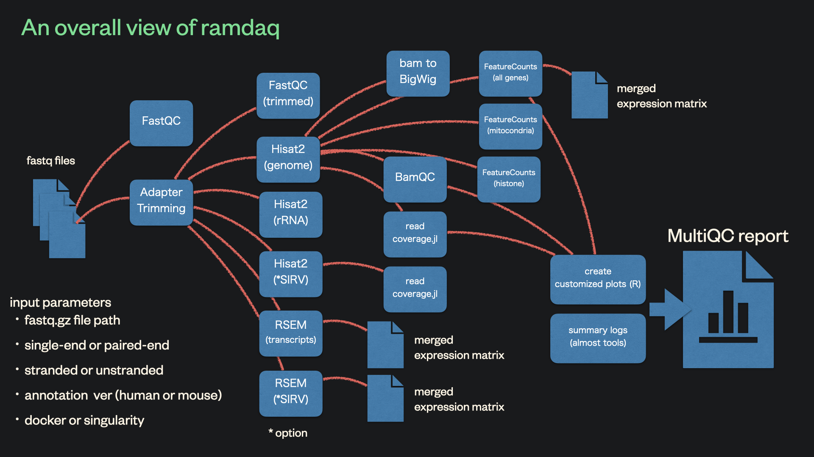

# 

**This pipeline analyses data from full-length single-cell RNA sequencing (scRNA-seq) methods.**

[](https://github.com/rikenbit/ramdaq/actions)
[](https://github.com/rikenbit/ramdaq/actions)
[](https://www.nextflow.io/)

<!-- [](https://hub.docker.com/r/myoshimura080822/ramdaq) -->

## Introduction

The pipeline is built using [Nextflow](https://www.nextflow.io), a workflow tool to run tasks across multiple compute infrastructures in a very portable manner. It comes with docker containers making installation trivial and results highly reproducible.

## Pipeline summary



1. Read QC (FastQC)
2. Adapter and quality trimming (FastqMcf)
3. Trimmed read QC (FastQC)
4. Sort and index alignments (Hisat2 and SAMtools)
5. Quantification of gene-level and transcript-level expression (RSEM)
6. Generation of BigWig (coverage) files (bam2wig)
7. Mapping/alginment QC:
    - RSeQC
    - readcoverage.jl
8. Quantification of gene-level expression (featureCounts)
9. Quantification of rRNA reads (HISAT2 and SAMtools)
10. Alignment and quantification of SIRV reads (HISAT2, SAMtools, and RSEM) (optional)
11. HTML QC report for raw read, alignment, gene biotype, sample similarity, and strand-specificity checks (MultiQC, R)

## Quick Start

i. Install [`nextflow`](https://nf-co.re/usage/installation)

ii. Install either [`Docker`](https://docs.docker.com/engine/installation/) or [`Singularity`](https://www.sylabs.io/guides/3.0/user-guide/) for full pipeline reproducibility (see [docs](https://nf-co.re/usage/configuration#basic-configuration-profiles)). Note that ramdaq does not support conda.

iii. Download the pipeline automatically and test it on a minimal dataset with a single command

*1.* Example of test using Docker

```bash
nextflow run rikenbit/ramdaq -profile test,docker --genome GRCm39_vM30_chr19
```

*2.* Example of test using Singularity

```bash
nextflow run rikenbit/ramdaq -profile test,singularity --genome GRCm39_vM30_chr19
```

iv. Start running your own analysis!

<!-- TODO: Update the default command above used to run the pipeline -->

iv-i. You can run ramdaq without donwloading reference annotation data.

```bash
nextflow run rikenbit/ramdaq -profile <docker/singularity> --reads '*_R{1,2}.fastq.gz' --genome GRCh38_v37
```

iv-i. You can also run ramdaq by specifying local paths to reference annotation (See ['Using provided reference genome and annotations'](docs/local_annotation.md)).

```bash
nextflow run rikenbit/ramdaq -profile <docker/singularity> --reads '*_R{1,2}.fastq.gz' --genome GRCh38_v37 --local_annot_dir <The directory path where the reference genome and annotations are placed>
```

See [usage docs](docs/usage.md) for all of the available options when running the pipeline.

## Managing and handling ramdaq version

### Pulling or updating ramdaq

To download or update ramdaq, run `nextflow pull`:

```bash
nextflow pull rikenbit/ramdaq
```

### Checking available versions

To check the available versions, run `nextflow info`:

```bash
nextflow info rikenbit/ramdaq
```

The above command will return the message like this (`* master (default)` indicates that the latest version will be used when you execute `nextflow run rikenbit/ramdaq ...`):

```bash
$ nextflow info rikenbit/ramdaq
 project name: rikenbit/ramdaq
 repository  : https://github.com/rikenbit/ramdaq
 local path  : /Users/haruka/.nextflow/assets/rikenbit/ramdaq
 main script : main.nf
 description : This pipeline analyses data from full-length single-cell RNA sequencing (scRNA-seq) methods.
 author      : Mika Yoshimura and Haruka Ozaki
 revisions   :
 * master (default)
   dev
   1.0 [t]
   1.1 [t]
```

### Using a specific version

To use versions other than the latest version, use `-r` to set the version name as follows:

```bash
nextflow run rikenbit/ramdaq -r 1.1 ...
```

## Documentation

The ramdaq pipeline comes with documentation about the pipeline, found in the `docs/` directory:

1. [Installation](https://nf-co.re/usage/installation)
2. [Pipeline configuration](https://nf-co.re/usage/adding_own_config)
3. Running the pipeline
    - [Usage](docs/usage.md)
    - [Examples](docs/examples.md)
    - [Using test data](docs/test_data.md)
    - [Using bcl2fastq](https://github.com/rikenbit/ramdaq_bcl2fastq)
        - If you need to use BCL files produced by Illumina sequencing machines, execute [ramdaq_bcl2fastq](https://github.com/rikenbit/ramdaq_bcl2fastq).
        - [bcl2fastq](https://support.illumina.com/sequencing/sequencing_software/bcl2fastq-conversion-software.html) is conversion software, which can be used to demultiplex data and convert BCL files to FASTQ file formats for downstream analysis.
        - Please see the README of [ramdaq_bcl2fastq](https://github.com/rikenbit/ramdaq_bcl2fastq) for details.
    - [Using provided reference genome and annotations](docs/local_annotation.md)
        - the current version supports human (GRCh38) and mouse (GRCm38).
    - [Using ramdaq on the NIG Supercomputer System](docs/nig_supercomputer_system.md)
4. [Output and how to interpret the results](docs/output.md)
5. Troubleshooting
    - [Troubleshooting » nf-core](https://nf-co.re/usage/troubleshooting)
    - [Troubleshooting specific to ramdaq](docs/troubleshooting.md)

## Credits

ramdaq is written and maintained by [Mika Yoshimura](https://github.com/myoshimura080822) and [Haruka Ozaki](https://github.com/yuifu) in the collaboration of [Laboratory for Bioinformatics Research, RIKEN Center for Biosystems Dynamics Research](https://bit.riken.jp/) and [Bioinformatics Laboratory, Faculty of Medicine, University of Tsukuba](https://sites.google.com/view/ozakilab).

ramdaq was originally developed based on the [nf-core](https://nf-co.re/) template.

## Citation

[](https://zenodo.org/badge/latestdoi/269006630)
