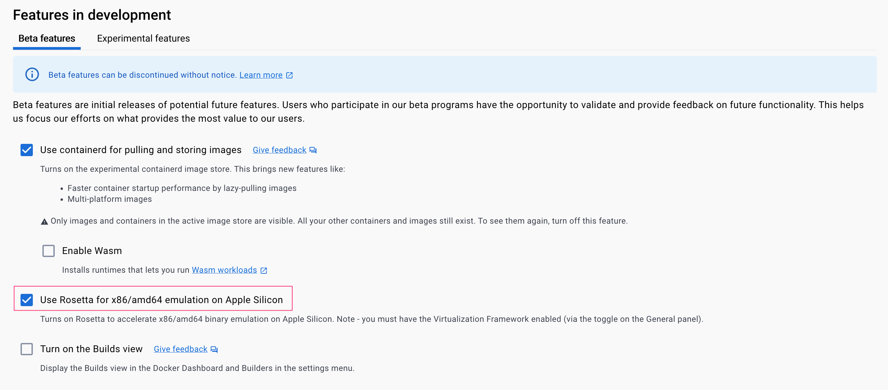

# ramdaq: troubleshooting

## Errors in Apple Silicon Mac environment specific

Errors like the following:

```bash
Command error:
  WARNING: The requested image’s platform (linux/amd64) does not match the detected host platform (linux/arm64/v8) and no specific platform was requested
```

- When executing a workflow on an Apple Silicon Mac (M1/M2), you might encounter a warning message from Docker. This causes the workflow to interpret the warning as an error, leading to the termination of the pipeline.
- The warning stems from a platform mismatch between the requested Docker image and the host platform. Specifically, with default settings, attempting to run a Docker image for linux/amd64 (as used by ramdaq) triggers this warning.

To fix this, please enable the option to run x86 containers in Docker Desktop for Mac settings.

1. Open Docker Desktop.
2. Navigate to Settings.
3. Locate the "Features in development" section and enable the "Use Rosetta for x86/amd64 emulation on Apple Silicon" option.
4. Restart Docker Desktop.



For detailed steps and background information, please refer to the following article:

[WARNING: The requested image’s platform (linux/amd64) does not match the detected host platform (linux/arm64/v8)](https://collabnix.com/warning-the-requested-images-platform-linux-amd64-does-not-match-the-detected-host-platform-linux-arm64-v8/)

## Unable to untar index file

Errors like the following:

```bash
Caused by:
  Process `untar_hisat2_idx` terminated with an error exit status (2)
```

```bash
Command error:
  
  gzip: stdin: unexpected end of file
  tar: Unexpected EOF in archive
  tar: Unexpected EOF in archive
  tar: Error is not recoverable: exiting now
```

By default, ramdaq downloads the large-size index files used by hisat2 and RSEM. In rare cases, this download process terminates incompletely and ramdaq exits with decompression fail. Rerunning ramdaq cannot remove this error.

To fix this, you have to remove the run's ```work/``` directory (e.g., with ```rm -rf work/```) and re-run ramdaq from scratch.
